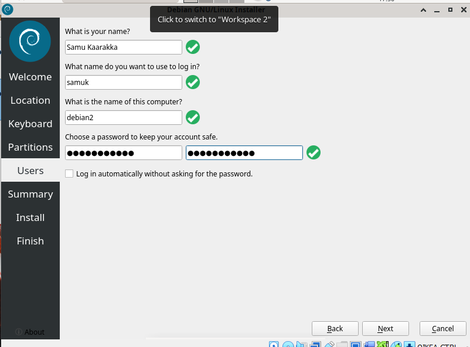
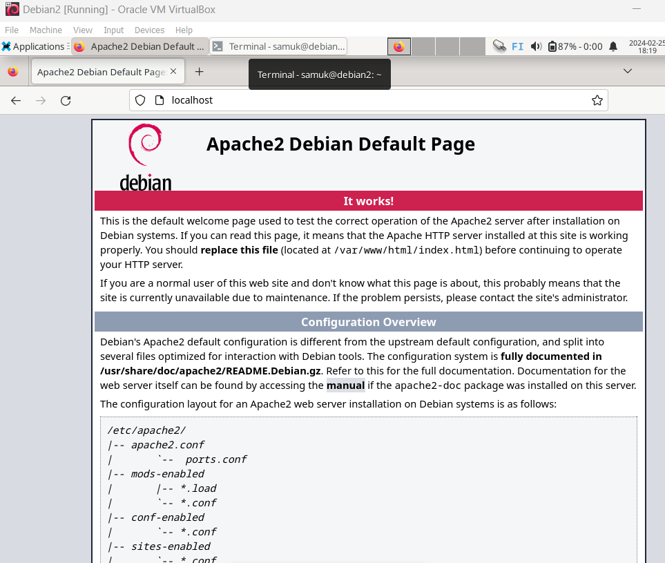
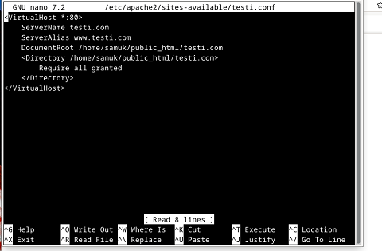
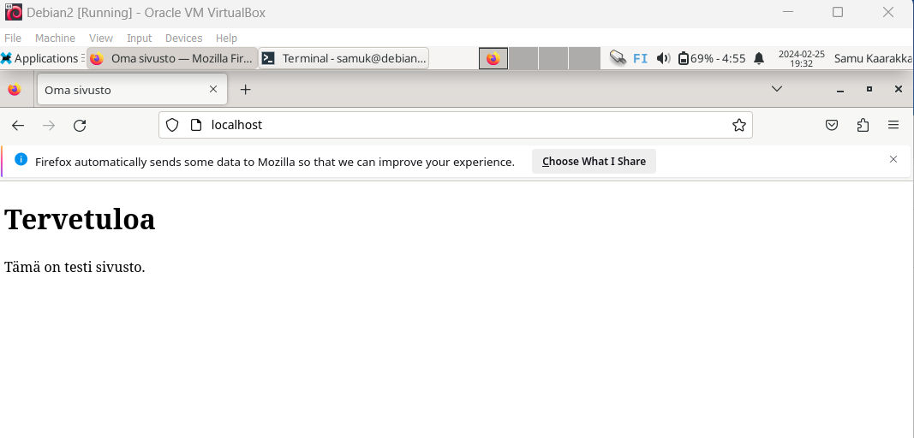
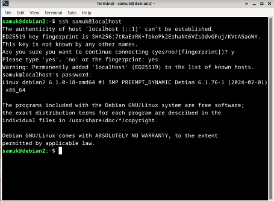
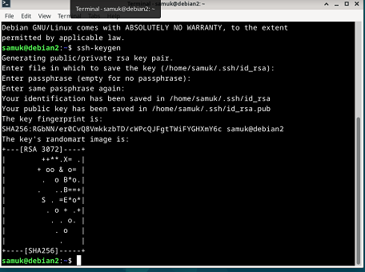
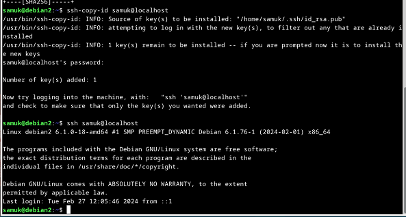
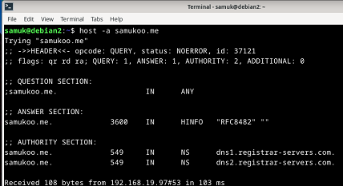

# Koko juttu

## A)Uuden virtuaalikoneen asennus

Asensin Oracle VM VirtualBoxissa uuden virtuaalikoneen. Asetuksina käytin samoja kuin aikaisemmissa asennuksissa: kieleksi American English, näppäimistön kieleksi Suomi sekä sijainniksi Helsinki. Debian installerissa Users-kohtaan annoin seuraavat tiedot:

Seuraavaksi tein tavalliset alkutoimenpiteet:

* Päivitykset komennolla : $ sudo apt-get -y dist-upgrade 

* Palomuurin asennus ja käyttöönotto komennoilla : $ sudo apt-get -y install ufw,
$ sudo ufw enable

### Apache weppipalvelin asennus

Asensin Apachen kommennoilla: 
$ sudo apt-get update
$ sudo apt-get -y install apache2

Tämän jälkeen testasin toimivuuden selaimessa localhost osoitteesta ja kaikki toimi tässä vaiheessa niinkuin pitikin:

### SSH-etähallintapalvelimen asennus

Asensin SSH:n komennoilla:
$ sudo apt-get install -y openssh-server
$ sudo systemctl enable ssh

### Uusi etusivu weppi-palvelimelle

Komennolla "sudoedit /etc/apache2/sites-available/testi.conf" avasin tekstieditorissa kyseisen tiedoston sekä muokkasin siihen haluamani <VirtualHost> tiedot:

Tämän jälkeen poistin vanhan default-sivun käytöstä komennolla $ sudo a2dissite 000-default.conf ja localhost sivu toimi niinkuin pitääkin.

Seuraavaksi muokkasin index.html tiedostoa niin, että se näyttäisi kunnollisemmalta html-sivustolta: 

## B) Pubkey

Syötin alkuun komennon `ssh samuk@localhost`:

Tämän jälkeen syötin komennon `ssh-keygen` käynnistääkseni avaimien luontiprosessin:

Seuraavaksi syötin komennon `ssh-copy-id samuk@localhost`, ja komennolla `ssh samuk@localhost` testasin, että kirjautumaan pääsee ilman salasanaa:

## C) Digging host

Asensin dnsutils-työkalun komennolla `sudo apt-get -y install dnsutils`, jotta host ja dig komennot toimisivat niinkuin pitääkin.

Seuraavaksi tein komennolla `host -a samukoo.me` DNS-kyselyn domain-nimestäni "samukoo.me" ja tulostui saatavilla olevat tiedot liittyen kyseiseen domainiin:

Tulostuneiden tietojen läpikäynnissä käytin avuksi ChatGPT:tä, koska en ollut tietoinen mitä kukin kohta tarkoitti:

* opcode: QUERY: Kertoo, että kyseessä on kysely
* status: NOERROR: Kertoo, että kysely onnistui ilman virheitä
* id: 37121: Kertoo kyselyn tunnisteen
* flags: qr rd ra: Näyttää kyselyn tilan, kuten qr (vastaus), rd (rekursiivinen kysely) ja ra (vastaus valmis)

### Question Section
* samukoo.me IN ANY kertoo, että kysely koskee kaikkia tietueita domain-nimessä samukoo.me

### Answer Section
* samukoo.me. 3600 IN HINFO "RFC8482" "": Tässä vastausosiossa on yksi tietue, joka kertoo, että "samukoo.me" -domainilla on HINFO-tietue ("RFC8482") ilman erityistä tietoa.

  ### Authority Section
* Tässä osiossa ovat nimipalvelimet, jotka ovat vastuussa "samukoo.me" -domainista. Niitä ovat dns1.registrar-servers.com ja dns2.registrar-servers.com.

Viimeinen tulostuksen kohta Received 108 bytes from 192.168.19.97#53 in 103 ms: Kertoo vastauksen koon, mistä palvelimelta vastaus tuli ja kuinka kauan aikaa vastauksen saamiseen kului.

